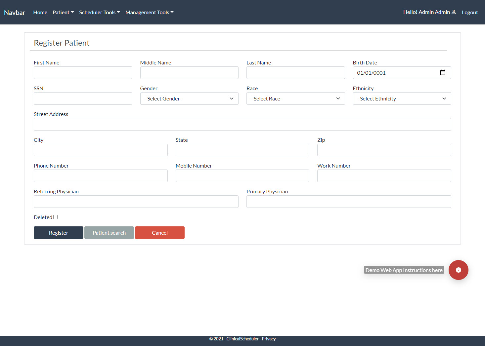

# Clinical Scheduler with EMR Functionality
 	

The application is a fully functioning Electronic Medical Record System (EMR) demo,that includes patient registration, appointment calendar scheduling, medical charting, diagnosis entry with type search using database stored ICD-10 diagnosis code bank, medical documentation, clinical orders, prescription, allergy documentation, appointment dashboard for tracking appointments and managing appointments, access and roles management. The application also has the functionality to manage system foundational settings and values such as, proivider appointment template builds with schedule blocks, clinic location builds, medical insurance maintenance, clinical order builds, core builds for values that the application needs by default, and much more, to try the application, please click "Demo website instructions" icon at the bottom right. The application was developed in C# .Net 6 with MS SQL as database.

***See the web app in action:*** <a href="https://clinicemrscheduler.azurewebsites.net/">Run Application</a>

# Features

* Patient Registration
* Search Functions
    * Patient search
    * Appointment search
    * Encounter search
* Appointment Scheduling
    * Calendar appointment scheduling
    * Encounter admission
    * Appointment Dashboard
    * Provider scheduling profile
* Medical Record Charting
    * ICD-10 diagnosis search & documentation
    * Clinical notes documentation
    * Allergies documentation
    * Clinical Ordering 
* System Mainteance
    * User Management
    * System foundational/default values
    * Clinic locations
    * Insurance
    * Orders

# Screenshots
#### Patient Registation
        
#### Search Functions
#### Appointment Scheduling
#### Medical Record Charting
#### System Maintenance

# Technology Stack
> 
>  
> 
> 
> 
> 
